# CattoPic

A self-hosted image hosting service with automatic format conversion, tag management, and a random image API. Built with Next.js frontend and Cloudflare Workers backend.

[中文文档](./docs/README_CN.md)

## Architecture

```mermaid
flowchart TB
    subgraph Client["👤 Client"]
        Browser["🌐 Browser"]
        API_Client["📱 API Client"]
    end

    subgraph Vercel["Vercel"]
        NextJS["⚛️ Next.js 16<br/>React 19 + Tailwind CSS"]
    end

    subgraph Cloudflare["Cloudflare Edge Network"]
        subgraph Worker["Worker Runtime"]
            Hono["🔥 Hono API<br/>REST Endpoints"]
        end

        subgraph Storage["Storage Layer"]
            R2[("📦 R2<br/>Object Storage<br/>───────────<br/>• Original images<br/>• WebP versions<br/>• AVIF versions")]
        end

        subgraph Data["Data Layer"]
            D1[("🗄️ D1<br/>SQLite Database<br/>───────────<br/>• Image metadata<br/>• Tags<br/>• API keys")]
            KV[("⚡ KV<br/>Key-Value Store<br/>───────────<br/>• Response cache<br/>• Rate limiting")]
        end

        subgraph Async["Async Processing"]
            Queue["📬 Queues<br/>───────────<br/>• File deletion<br/>• Batch operations"]
            Cron["⏰ Cron Triggers<br/>───────────<br/>• Cleanup expired<br/>• Hourly schedule"]
        end

        subgraph Transform["Image Processing"]
            Images["🖼️ Cloudflare Images<br/>───────────<br/>• WebP conversion<br/>• AVIF conversion<br/>• Quality optimization"]
        end
    end

    Browser -->|"HTTPS"| NextJS
    NextJS -->|"API Requests"| Hono
    API_Client -->|"Direct API"| Hono

    Hono -->|"Read/Write"| R2
    Hono -->|"Query/Update"| D1
    Hono -->|"Cache"| KV
    Hono -->|"Async Tasks"| Queue
    Hono -->|"Transform"| Images

    Queue -->|"Process"| R2
    Cron -->|"Trigger"| Hono
    Images -->|"Output"| R2

    style Cloudflare fill:#f5f5f5,stroke:#f38020,stroke-width:2px
    style Vercel fill:#f5f5f5,stroke:#000,stroke-width:2px
    style Worker fill:#fff3e0,stroke:#f38020
    style Storage fill:#e3f2fd,stroke:#1976d2
    style Data fill:#e8f5e9,stroke:#388e3c
    style Async fill:#fce4ec,stroke:#c2185b
    style Transform fill:#f3e5f5,stroke:#7b1fa2
```



### Component Overview

| Component | Service | Purpose |
|-----------|---------|---------|
| **Frontend** | Vercel + Next.js | Management UI, image browser, upload interface |
| **API** | Cloudflare Worker + Hono | RESTful API, authentication, request routing |
| **Storage** | Cloudflare R2 | Store original and converted images (WebP/AVIF) |
| **Database** | Cloudflare D1 | Image metadata, tags, API keys (SQLite) |
| **Cache** | Cloudflare KV | Response caching, reduce D1 queries |
| **Queue** | Cloudflare Queues (optional) | Async file deletion, batch processing |
| **Images** | Cloudflare Images | On-the-fly format conversion and optimization |
| **Cron** | Cron Triggers | Scheduled cleanup of expired images |

## Features

- **Multi-format Support** - Upload JPEG, PNG, GIF, WebP, AVIF images
- **Automatic Conversion** - Auto-generate WebP and AVIF versions for optimal delivery
- **Tag Management** - Organize images with tags, batch operations supported
- **Random Image API** - Public API for random images with filtering options
- **Expiry Support** - Set expiration time for temporary images
- **Modern UI** - Clean management interface with dark mode support

## Tech Stack

| Component | Technology |
|-----------|------------|
| Frontend | Next.js 16, React 19, Tailwind CSS |
| Backend | Cloudflare Workers, Hono |
| Storage | Cloudflare R2 |
| Database | Cloudflare D1 (SQLite) |
| Cache | Cloudflare KV |

## Quick Start

### Prerequisites

- Node.js >= 18
- [pnpm](https://pnpm.io/) package manager
- [Cloudflare account](https://dash.cloudflare.com/)
- [Vercel account](https://vercel.com/) (or any static hosting)

### 1. Clone and Install

```bash
git clone https://github.com/yourusername/cattopic.git
cd cattopic
pnpm install
cd worker && pnpm install
```

### 2. Setup Cloudflare Resources

```bash
cd worker
pnpm wrangler login

# Create R2 bucket
pnpm wrangler r2 bucket create cattopic-r2

# Create D1 database
pnpm wrangler d1 create CattoPic-D1
# Note the database_id from output

# Create KV namespace
pnpm wrangler kv namespace create CACHE_KV
# Note the id from output

# (Optional) Create Queue - only needed if USE_QUEUE = 'true'
# Requires Cloudflare Workers Paid plan
pnpm wrangler queues create cattopic-delete-queue

# Initialize database schema
pnpm wrangler d1 execute CattoPic-D1 --remote --file=schema.sql
```

### 3. Configure Worker

```bash
cp wrangler.example.toml wrangler.toml
```

Edit `wrangler.toml` with your resource IDs:

```toml
[vars]
R2_PUBLIC_URL = 'https://your-r2-domain.com'
# Set to 'true' to use Cloudflare Queues for async R2 deletion
# Set to 'false' or remove for synchronous deletion (no Queue required)
USE_QUEUE = 'false'

[[r2_buckets]]
bucket_name = 'cattopic-r2'

[[d1_databases]]
database_name = 'CattoPic-D1'
database_id = '<your-database-id>'

[[kv_namespaces]]
id = "<your-kv-id>"

# (Optional) Only needed if USE_QUEUE = 'true'
# [[queues.producers]]
# queue = "cattopic-delete-queue"
#
# [[queues.consumers]]
# queue = "cattopic-delete-queue"
```

### 4. Deploy Worker

**Option A: Manual Deploy**

```bash
pnpm wrangler deploy
```

**Option B: GitHub Actions (Recommended for Fork users)**

GitHub Actions deployment avoids configuration conflicts when syncing upstream.

1. **Create API Token**: Go to [Cloudflare API Tokens](https://dash.cloudflare.com/profile/api-tokens) → Create Token → Use "Edit Cloudflare Workers" template

2. **Get Account ID**: Run `pnpm wrangler whoami` to find your Account ID

3. **Configure GitHub Secrets** (Settings → Secrets and variables → Actions):

| Secret | Description |
|--------|-------------|
| `CLOUDFLARE_API_TOKEN` | Your API Token |
| `CLOUDFLARE_ACCOUNT_ID` | Your Account ID |
| `WRANGLER_TOML` | Complete content of your `wrangler.toml` file |

4. **Trigger**: Push to `worker/**` on main branch, or manually trigger via Actions tab

### 5. Add API Key

```bash
pnpm wrangler d1 execute CattoPic-D1 --remote --command "
INSERT INTO api_keys (key, created_at) VALUES ('your-secure-api-key', datetime('now'));
"
```

### 6. Deploy Frontend

Deploy to Vercel with environment variable:

| Variable | Value |
|----------|-------|
| `NEXT_PUBLIC_API_URL` | `https://your-worker.workers.dev` |
| `NEXT_PUBLIC_REMOTE_PATTERNS` | `https://your-worker.workers.dev,https://r2`|

## API Overview

### Public Endpoints

#### Random Image

```bash
GET /api/random
```

Returns a random image. Supports filtering:

```bash
# Get random landscape image
curl "https://api.example.com/api/random?orientation=landscape"

# Filter by tags
curl "https://api.example.com/api/random?tags=nature,outdoor"

# Exclude tags
curl "https://api.example.com/api/random?exclude=private"

# Request specific format
curl "https://api.example.com/api/random?format=webp"

# Combine filters
curl "https://api.example.com/api/random?orientation=portrait&tags=cat&format=avif"
```

| Parameter | Values | Description |
|-----------|--------|-------------|
| `orientation` | `landscape`, `portrait`, `auto` | Image orientation (auto detects from User-Agent) |
| `tags` | comma-separated | Include images with ALL specified tags |
| `exclude` | comma-separated | Exclude images with ANY specified tags |
| `format` | `original`, `webp`, `avif` | Response format (auto-negotiated if not specified) |

### Protected Endpoints

All other endpoints require authentication:

```bash
Authorization: Bearer <your-api-key>
```

| Method | Endpoint | Description |
|--------|----------|-------------|
| POST | `/api/upload/single` | Upload image |
| GET | `/api/images` | List images (paginated) |
| GET | `/api/images/:id` | Get image details |
| PUT | `/api/images/:id` | Update image metadata |
| DELETE | `/api/images/:id` | Delete image |
| GET | `/api/tags` | List all tags |
| POST | `/api/tags` | Create tag |
| PUT | `/api/tags/:name` | Rename tag |
| DELETE | `/api/tags/:name` | Delete tag and associated images |
| POST | `/api/tags/batch` | Batch tag operations |

## Documentation

- [Deployment Guide](./DEPLOYMENT.md) (Chinese)
- [Deployment Guide](./docs/DEPLOYMENT_EN.md) (English)
- [API Documentation](./docs/API.md) (Chinese)
- [API Documentation](./docs/API_EN.md) (English)

## Local Development

```bash
# Terminal 1: Start worker
cd worker
pnpm dev

# Terminal 2: Start frontend
pnpm dev
```

Create `.env.local`:

```env
NEXT_PUBLIC_API_URL=http://localhost:8787
```

## License

[GPL-3.0](./LICENSE)


