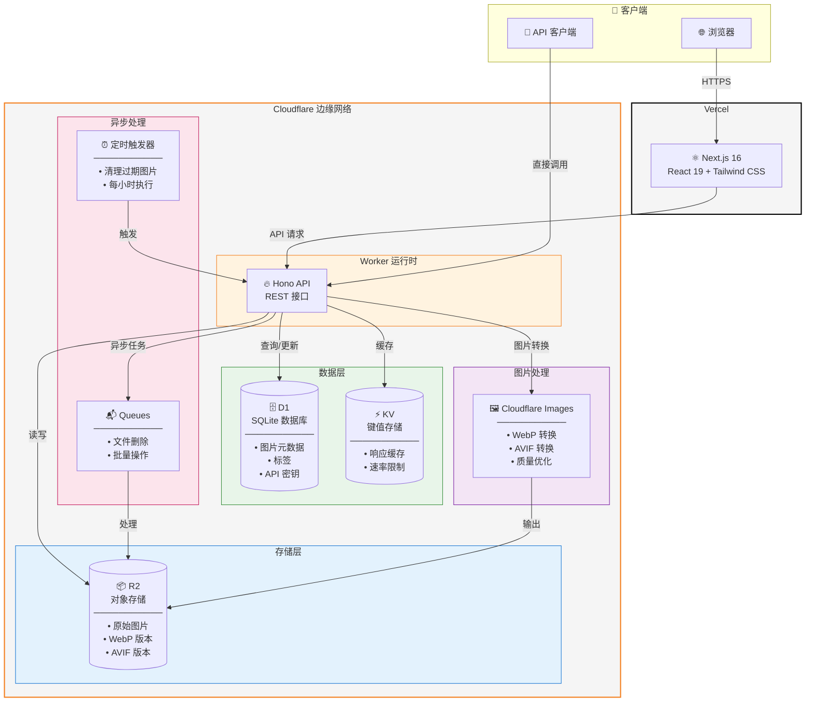

# CattoPic

一个自托管的图片托管服务，支持自动格式转换、标签管理和随机图片 API。基于 Next.js 前端和 Cloudflare Workers 后端构建。

[English](../README.md)

## 系统架构



### 组件说明

| 组件 | 服务 | 用途 |
|------|------|------|
| **前端** | Vercel + Next.js | 管理界面、图片浏览、上传功能 |
| **API** | Cloudflare Worker + Hono | RESTful API、认证、请求路由 |
| **存储** | Cloudflare R2 | 存储原始图片和转换后的图片（WebP/AVIF） |
| **数据库** | Cloudflare D1 | 图片元数据、标签、API 密钥（SQLite） |
| **缓存** | Cloudflare KV | 响应缓存，减少 D1 查询 |
| **队列** | Cloudflare Queues（可选） | 异步文件删除、批量处理 |
| **图片处理** | Cloudflare Images | 实时格式转换和优化 |
| **定时任务** | Cron Triggers | 定时清理过期图片 |

## 功能特性

- **多格式支持** - 上传 JPEG、PNG、GIF、WebP、AVIF 图片
- **自动转换** - 自动生成 WebP 和 AVIF 版本以优化传输
- **标签管理** - 使用标签组织图片，支持批量操作
- **随机图片 API** - 公开 API，支持多种过滤条件
- **过期支持** - 为临时图片设置过期时间
- **现代化 UI** - 简洁的管理界面，支持深色模式

## 技术栈

| 组件 | 技术 |
|------|------|
| 前端 | Next.js 16, React 19, Tailwind CSS |
| 后端 | Cloudflare Workers, Hono |
| 存储 | Cloudflare R2 |
| 数据库 | Cloudflare D1 (SQLite) |
| 缓存 | Cloudflare KV |

## 快速开始

### 前置条件

- Node.js >= 18
- [pnpm](https://pnpm.io/) 包管理器
- [Cloudflare 账户](https://dash.cloudflare.com/)
- [Vercel 账户](https://vercel.com/)（或其他静态托管服务）

### 1. 克隆并安装

```bash
git clone https://github.com/yourusername/cattopic.git
cd cattopic
pnpm install
cd worker && pnpm install
```

### 2. 创建 Cloudflare 资源

```bash
cd worker
pnpm wrangler login

# 创建 R2 存储桶
pnpm wrangler r2 bucket create cattopic-r2

# 创建 D1 数据库
pnpm wrangler d1 create CattoPic-D1
# 记录输出中的 database_id

# 创建 KV 命名空间
pnpm wrangler kv namespace create CACHE_KV
# 记录输出中的 id

# （可选）创建队列 - 仅在 USE_QUEUE = 'true' 时需要
# 需要 Cloudflare Workers 付费计划
pnpm wrangler queues create cattopic-delete-queue

# 初始化数据库表结构
pnpm wrangler d1 execute CattoPic-D1 --remote --file=schema.sql
```

### 3. 配置 Worker

```bash
cp wrangler.example.toml wrangler.toml
```

编辑 `wrangler.toml`，填入你的资源 ID：

```toml
[vars]
R2_PUBLIC_URL = 'https://your-r2-domain.com'
# 设置为 'true' 启用 Cloudflare Queues 异步删除 R2 文件
# 设置为 'false' 或不设置则使用同步删除（无需 Queue）
USE_QUEUE = 'false'

[[r2_buckets]]
bucket_name = 'cattopic-r2'

[[d1_databases]]
database_name = 'CattoPic-D1'
database_id = '<你的数据库ID>'

[[kv_namespaces]]
id = "<你的KV-ID>"

# （可选）仅在 USE_QUEUE = 'true' 时需要
# [[queues.producers]]
# queue = "cattopic-delete-queue"
#
# [[queues.consumers]]
# queue = "cattopic-delete-queue"
```

### 4. 部署 Worker

**方式 A：手动部署**

```bash
pnpm wrangler deploy
```

**方式 B：GitHub Actions（推荐 Fork 用户使用）**

使用 GitHub Actions 部署可避免同步上游时的配置冲突。

1. **创建 API Token**：前往 [Cloudflare API Tokens](https://dash.cloudflare.com/profile/api-tokens) → Create Token → 选择 "Edit Cloudflare Workers" 模板

2. **获取 Account ID**：运行 `pnpm wrangler whoami` 查看你的 Account ID

3. **配置 GitHub Secrets**（Settings → Secrets and variables → Actions）：

| Secret | 说明 |
|--------|------|
| `CLOUDFLARE_API_TOKEN` | 你的 API Token |
| `CLOUDFLARE_ACCOUNT_ID` | 你的 Account ID |
| `WRANGLER_TOML` | 完整的 `wrangler.toml` 文件内容 |

4. **触发方式**：推送到 main 分支的 `worker/**` 目录，或在 Actions 标签页手动触发

### 5. 添加 API Key

```bash
pnpm wrangler d1 execute CattoPic-D1 --remote --command "
INSERT INTO api_keys (key, created_at) VALUES ('your-secure-api-key', datetime('now'));
"
```

### 6. 部署前端

在 Vercel 配置环境变量后部署：

| 变量名 | 值 |
|--------|-----|
| `NEXT_PUBLIC_API_URL` | `https://your-worker.workers.dev` |
| `NEXT_PUBLIC_REMOTE_PATTERNS` | `https://your-worker.workers.dev,https://r2`|

## API 概览

### 公开接口

#### 随机图片

```bash
GET /api/random
```

返回一张随机图片，支持过滤：

```bash
# 获取横向随机图片
curl "https://api.example.com/api/random?orientation=landscape"

# 按标签过滤
curl "https://api.example.com/api/random?tags=nature,outdoor"

# 排除标签
curl "https://api.example.com/api/random?exclude=private"

# 指定返回格式
curl "https://api.example.com/api/random?format=webp"

# 组合过滤条件
curl "https://api.example.com/api/random?orientation=portrait&tags=cat&format=avif"
```

| 参数 | 可选值 | 说明 |
|------|--------|------|
| `orientation` | `landscape`, `portrait`, `auto` | 图片方向（auto 根据 User-Agent 自动判断） |
| `tags` | 逗号分隔 | 包含所有指定标签的图片 |
| `exclude` | 逗号分隔 | 排除包含任一指定标签的图片 |
| `format` | `original`, `webp`, `avif` | 返回格式（未指定时自动协商） |

### 受保护接口

其他接口需要认证：

```bash
Authorization: Bearer <your-api-key>
```

| 方法 | 路径 | 说明 |
|------|------|------|
| POST | `/api/upload/single` | 上传图片 |
| GET | `/api/images` | 获取图片列表（分页） |
| GET | `/api/images/:id` | 获取图片详情 |
| PUT | `/api/images/:id` | 更新图片元数据 |
| DELETE | `/api/images/:id` | 删除图片 |
| GET | `/api/tags` | 获取所有标签 |
| POST | `/api/tags` | 创建标签 |
| PUT | `/api/tags/:name` | 重命名标签 |
| DELETE | `/api/tags/:name` | 删除标签及关联图片 |
| POST | `/api/tags/batch` | 批量标签操作 |

## 文档

- [部署指南](../DEPLOYMENT.md)（中文）
- [部署指南](./DEPLOYMENT_EN.md)（英文）
- [API 文档](./API.md)（中文）
- [API 文档](./API_EN.md)（英文）

## 本地开发

```bash
# 终端 1：启动 Worker
cd worker
pnpm dev

# 终端 2：启动前端
pnpm dev
```

创建 `.env.local`：

```env
NEXT_PUBLIC_API_URL=http://localhost:8787
```

## 许可证

[GPL-3.0](../LICENSE)
